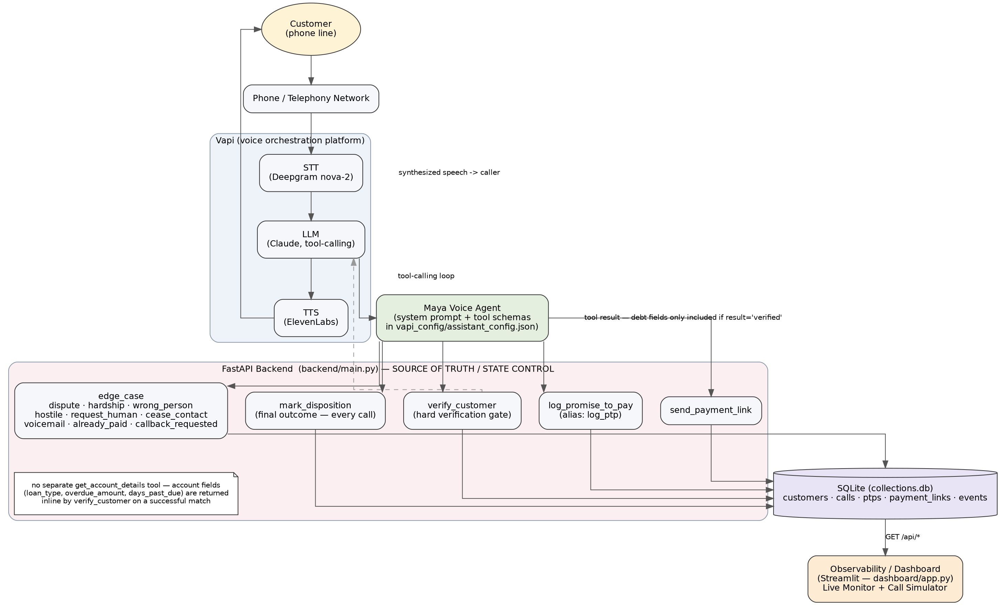

# High-Level Design (HLD)
## Maya — AI Voice Collections Agent for Kapture Finance

**Document status:** Describes the actual state of the codebase in this repository
(`collections-agent/`) as of this revision. Every section is explicit about what is
**Implemented**, what is **Mocked** (works end-to-end in this prototype but stands in
for a real integration), and what is a **Production Recommendation** (not built here).
No implementation detail below is invented — anything that isn't in `backend/main.py`,
`dashboard/app.py`, or `vapi_config/assistant_config.json` is labeled as a
recommendation, not a claim about existing code.

---

## 1. Executive Summary

**Business problem.** Kapture Finance needs to remind borrowers about overdue EMIs and
capture a resolution — a payment promise, a payment, or a compliant reason collection
can't proceed right now (dispute, hardship, wrong number, do-not-call, etc.) — at a
scale a human calling team can't reach alone, without violating lending-collections
compliance norms (no harassment, no fabricated legal threats, no debt disclosure to the
wrong person).

**Purpose of Maya.** Maya is an outbound AI voice agent that places (or receives, in a
simulated form) a collections call, confirms it is speaking with the actual account
holder, discloses the overdue EMI only after that confirmation succeeds, and then
either logs a promise-to-pay, sends a payment link, or routes the call into one of nine
well-defined non-payment outcomes — always ending with exactly one recorded
disposition.

**What the AI agent does, concretely.**
1. Introduces itself and Kapture Finance without stating any account details.
2. Verifies the caller (name + DOB + last 4 digits of the loan account, matched against
   the caller's phone number).
3. Only on a successful match, discloses the loan type, overdue EMI amount, and days
   past due.
4. Determines intent (will pay, hardship, dispute, already paid, callback, wrong
   person, do-not-call, hostile, request human, no response) and calls the matching
   backend tool.
5. Records one final disposition and ends the call.

**Major safety principle.** *Debt information MUST NEVER be disclosed before
successful customer verification.* This is the single hardest requirement in the
system, and it is enforced in the **FastAPI backend**, not only in the LLM's system
prompt — see §4 and §7 for exactly how.

**Scope of this prototype (Implemented).**
- A FastAPI mock backend (`backend/main.py`) with a SQLite database, acting as the
  system of record and the sole authority for what may be disclosed or logged.
- A Streamlit dashboard (`dashboard/app.py`) that (a) monitors real call activity by
  reading the same backend, and (b) simulates a full call — including every edge case —
  by firing the same tool endpoints Vapi would fire, so the flow can be demoed and
  reviewed without a live phone call.
- A Vapi assistant configuration template (`vapi_config/assistant_config.json`) with a
  completed system prompt, tool schemas, model/voice/transcriber selection, and a
  render/deploy script (`scripts/render_vapi_config.py`).
- Everything is a **mock**: there is no real telephony carrier account, no real
  ElevenLabs/Deepgram/Vapi credentials, and no real payment gateway wired up in this
  repository. What's real is the state machine, the enforcement logic, and the
  configuration needed to point a genuine Vapi assistant at this backend.
- **Not in scope / not built:** an actual placed phone call (see §13 and
  `docs/VAPI_DEPLOYMENT.md` for exactly what remains manual), a real core-banking
  lookup, a real payment processor, and production-grade authentication/observability
  infrastructure.

---

## 2. Architecture

**Implemented data flow:**

```
Customer  --(PSTN/phone)-->  Telephony  -->  Vapi
                                              ├── STT   (Deepgram)     — implemented in vapi_config (config only; the
                                              ├── LLM   (Claude)       —   actual STT/LLM/TTS execution happens inside
                                              └── TTS   (ElevenLabs)   —   Vapi's platform, not in this repo)
                                              -> Maya (tool-calling loop, driven by
                                                 vapi_config/assistant_config.json)
                                              -> FastAPI Backend (backend/main.py)  <-- IMPLEMENTED, this repo
                                                 ├── verify_customer
                                                 ├── log_promise_to_pay (alias log_ptp)
                                                 ├── send_payment_link
                                                 ├── edge_case
                                                 └── mark_disposition
                                              -> SQLite (backend/collections.db)     <-- IMPLEMENTED
                                              -> Streamlit Dashboard (dashboard/app.py) <-- IMPLEMENTED
```

See `docs/architecture.png` for the rendered diagram (source: `docs/architecture.dot`,
built with Graphviz).

**Where each component actually lives:**

| Component | Status | Location |
|---|---|---|
| Telephony (PSTN) | Not in this repo — Vapi's phone number product | n/a |
| STT (Deepgram nova-2) | **Configured**, not executed here | `vapi_config/assistant_config.json` → `transcriber` |
| LLM (Claude, tool-calling) | **Configured**, not executed here | `vapi_config/assistant_config.json` → `model` |
| TTS (ElevenLabs) | **Configured**, not executed here | `vapi_config/assistant_config.json` → `voice` |
| Maya's conversational logic | **Implemented** (as a prompt + tool schema, interpreted by the LLM at call time) | `vapi_config/assistant_config.json` → `model.messages[0].content` |
| State / flow control | **Implemented in code**, server-side | `backend/main.py` (`calls` table, `require_verified()`, `DISPOSITIONS_REQUIRING_PRIOR_VERIFICATION`) |
| Backend tools | **Implemented** | `backend/main.py`, `/tools/*` routes |
| Mock database | **Implemented** | SQLite, `backend/collections.db`, created on startup |
| Dashboard / Observability | **Implemented** | `dashboard/app.py` (Streamlit) |
| Real payment gateway | **Mocked** — `send_payment_link` returns a fake `https://pay.kapturefinance-mock.com/...` URL | `backend/main.py` → `send_payment_link()` |
| Real core-banking "was this actually paid" check | **Mocked** — `already_paid` is logged and escalated for human/ops follow-up; the backend cannot verify it | `backend/main.py` → `edge_case()` |

---

## 3. Architecture Diagram



*(Source: `docs/architecture.dot`, rendered with Graphviz. If the image doesn't
display in your Markdown viewer, open `docs/architecture.png` directly.)*

It shows the same top-to-bottom path described in §2: Customer → Telephony → Vapi
(STT/LLM/TTS) → Maya → FastAPI Backend (five tools) → SQLite → Dashboard, plus the
two enforcement-relevant return edges (a tool result only carries debt fields when
`result == "verified"`, and the dashboard reads the same tables the tools write).

---

## 4. Conversation State Machine

**States** (mapped onto the `calls.status` column in SQLite, which doubles as both the
call's lifecycle status *and* the verification gate — see the callout below):

```
CALL_STARTED
   │  (row created on first tool call for this call_id; status='in_progress')
   ▼
DISCLOSURE-BLOCKED  (implicit — this is just "status != 'verified'")
   │  agent asks for name + DOB + last 4
   ▼
VERIFY_IDENTITY  -->(verify_customer tool call)-->  AUTHENTICATED  (status='verified')
   │  no match / attempt 1 or 2                                │
   ▼                                                            ▼
[retry once]                                          DEBT_DISCLOSURE
   │  2nd failure                                               │  Maya states loan_type,
   ▼                                                             │  overdue_amount_cents,
FAILED_VERIFICATION (status='failed_verification')              │  days_past_due — fields
   │                                                             │  returned by verify_customer
   ▼                                                             ▼
[mark_disposition: FAILED_VERIFICATION] --> CALL_CLOSED     INTENT_DETECTION
                                                                  │
        ┌───────────┬───────────┬────────────┬─────────────┬────┴────────┬──────────────┬───────────────┬────────────┬──────────────┐
        ▼           ▼           ▼            ▼             ▼             ▼              ▼               ▼            ▼              ▼
    WILL_PAY    HARDSHIP    DISPUTE    ALREADY_PAID   CALLBACK_    WRONG_PERSON   DO_NOT_CALL       HOSTILE     REQUEST_HUMAN   NO_RESPONSE
                                                        REQUESTED
        │           │           │            │             │             │              │               │            │              │
        ▼           ▼           ▼            ▼             ▼             ▼              ▼               ▼            ▼              ▼
   log_promise_  edge_case   edge_case   edge_case     edge_case      edge_case     edge_case       edge_case    edge_case    (no tool required —
   to_pay [+     (hardship)  (dispute_   (already_     (callback_     (wrong_       (cease_          (hostile)    (request_    silence/no answer)
   send_payment_             debt)       paid)         requested,     person)       contact)                     human)
   link]                                               needs date+time)
        │           │           │            │             │             │              │               │            │              │
        └───────────┴───────────┴────────────┴─────────────┴─────────────┴──────────────┴───────────────┴────────────┴──────────────┘
                                                             ▼
                                                    ACTION already taken above (tool calls)
                                                             ▼
                                              mark_disposition (exactly once, required)
                                                             ▼
                                                        DISPOSITION recorded
                                                       (calls.disposition set;
                                                        calls.status -> 'closed',
                                                        or 'escalated' if
                                                        disposition='ESCALATED')
                                                             ▼
                                                        CALL_CLOSED
```

**Transition conditions, explicitly:**

| Transition | Condition (as implemented) |
|---|---|
| `CALL_STARTED` → any tool call | First tool call for a `call_id` implicitly creates the row (`ensure_call()`), `status='in_progress'`. |
| `VERIFY_IDENTITY` → `AUTHENTICATED` | `POST /tools/verify_customer` finds a customer whose `phone`, `full_name` (case-insensitive), `dob`, and `last4` all match what the caller stated. Sets `status='verified'`. **This is the only transition that unlocks debt disclosure.** |
| `VERIFY_IDENTITY` → retry | Match fails and `verification_attempts < 2`. Returns `{"result": "failed", "attempts_remaining": ...}`; caller may try once more. |
| `VERIFY_IDENTITY` → `FAILED_VERIFICATION` | Match fails on the 2nd attempt. `status='failed_verification'`. No further verification attempts are accepted for this `call_id` (a 3rd `verify_customer` call still just fails the same way — nothing re-opens the gate). |
| `AUTHENTICATED` → `DEBT_DISCLOSURE` | Implicit — the `verify_customer` response itself carries `loan_type`, `overdue_amount_cents`, `days_past_due` only when `result == "verified"`. The agent is instructed to speak these; the backend has already decided whether it was allowed to know them. |
| `INTENT_DETECTION` → `WILL_PAY` branch | Agent calls `log_promise_to_pay`. Backend requires `status == 'verified'` (`require_verified()`, HTTP 403 otherwise) and `amount_cents >= floor` (`overdue_amount_cents * min_settlement_pct / 100`), else returns `{"result": "rejected", ...}` without logging anything. |
| → `send_payment_link` (optional, inside `WILL_PAY`) | Also requires `status == 'verified'`. |
| → `HARDSHIP` / `DISPUTE` / `WRONG_PERSON` / `HOSTILE` / `REQUEST_HUMAN` / `DO_NOT_CALL` (`cease_contact`) / `ALREADY_PAID` | Agent calls `edge_case` with the matching `kind`. `hostile`, `request_human`, `dispute_debt`, and `already_paid` set `status='escalated'`. `cease_contact` additionally sets `customers.cease_contact = 1` **permanently** (so a future call to the same phone number is auto-blocked from debt disclosure at `verify_customer` time — see §7) and `status='closed'`. |
| → `CALLBACK_REQUESTED` | Agent calls `edge_case` with `kind='callback_requested'`. Backend **requires** both `callback_date` and `callback_time` in the request — returns HTTP 422 if either is missing — and stores them on the `calls` row. |
| `NO_RESPONSE` | No dedicated tool; the agent is instructed to call `mark_disposition` directly with `NO_RESPONSE` after reasonable silence, or `voicemail` via `edge_case` if it reached a machine. |
| Any branch → `DISPOSITION` | Agent calls `mark_disposition` with one of the 12 enum values. **Independently of everything above**, the backend refuses to record a debt-related disposition (`PROMISE_TO_PAY`, `PAYMENT_LINK_SENT`, `ALREADY_PAID`, `DISPUTE`, `HARDSHIP`, `CALLBACK_REQUESTED`) unless `calls.customer_id` is set — i.e., unless this call actually completed verification at some point, regardless of what the model claims happened. HTTP 403 otherwise. |
| `DISPOSITION` → `CALL_CLOSED` | `mark_disposition` sets `calls.status = 'closed'` (or `'escalated'` if the disposition itself is `ESCALATED`). |

**The most important rule, stated explicitly:** no state, and no tool, allows debt
disclosure while `verification_status != VERIFIED`. Concretely: `verify_customer`
only *returns* `loan_type` / `overdue_amount_cents` / `days_past_due` in the branch
where the DB match succeeded; `log_promise_to_pay` and `send_payment_link` call
`require_verified()` first and raise **HTTP 403** otherwise, closing the DB connection
before touching any customer data; and `mark_disposition` separately refuses any
debt-related disposition on a call whose `customer_id` was never set. There is no code
path in `backend/main.py` where a debt amount, loan type, or days-past-due value is
returned to the caller of an unverified call. This is enforced by the backend
regardless of what the LLM is told to do — see §7 for why that distinction matters.

---

## 5. Intents and Entities

| Intent | Backend tool called | Resulting disposition |
|---|---|---|
| `WILL_PAY` | `log_promise_to_pay`, optionally `send_payment_link` | `PROMISE_TO_PAY` or `PAYMENT_LINK_SENT` |
| `HARDSHIP` | `edge_case(kind='hardship')` | `HARDSHIP` |
| `DISPUTE` | `edge_case(kind='dispute_debt')` | `DISPUTE` |
| `ALREADY_PAID` | `edge_case(kind='already_paid')` | `ALREADY_PAID` |
| `WRONG_PERSON` | `edge_case(kind='wrong_person')` | `WRONG_PERSON` |
| `CALLBACK_REQUESTED` | `edge_case(kind='callback_requested')` | `CALLBACK_REQUESTED` |
| `DO_NOT_CALL` | `edge_case(kind='cease_contact')` | `DO_NOT_CALL` |
| `HOSTILE` | `edge_case(kind='hostile')` | `OTHER` or `ESCALATED` (agent's judgment call, not backend-enforced) |
| `REQUEST_HUMAN` | `edge_case(kind='request_human')` | `ESCALATED` |
| `NO_RESPONSE` | none required (or `edge_case(kind='voicemail')` if a machine was reached) | `NO_RESPONSE` |

**Entities**, and where each one lives:

| Entity | Type / format | Where it's captured |
|---|---|---|
| `customer_name` | string | Input to `verify_customer` (`full_name`); stored as `customers.full_name` |
| `loan_type` | string, e.g. `"Personal Loan"` | `customers.loan_type`; returned by `verify_customer` on success |
| `overdue_amount` | integer, paise (INR × 100) | `customers.overdue_amount_cents`; returned as `overdue_amount_cents` |
| `days_past_due` | integer | `customers.days_past_due`; returned by `verify_customer` |
| `ptp_amount` | integer, paise | Input to `log_promise_to_pay` (`amount_cents`); stored in `ptps.amount_cents` |
| `ptp_date` | `YYYY-MM-DD` | Input to `log_promise_to_pay` (`due_date`); stored in `ptps.due_date` |
| `callback_date` | `YYYY-MM-DD` | Input to `edge_case` when `kind='callback_requested'`; stored in `calls.callback_date` |
| `callback_time` | `HH:MM` (24h) | Input to `edge_case` when `kind='callback_requested'`; stored in `calls.callback_time` |
| `dispute_reason` | free text | Passed as `edge_case.note` when `kind='dispute_debt'`; stored in `events.detail` (not a first-class column — see §13 for the production recommendation) |
| `verification_status` | derived: `NOT_VERIFIED` \| `VERIFIED` \| `FAILED_MAX_ATTEMPTS` | Represented by `calls.status` ∈ `{in_progress, verified, failed_verification}` — see the callout in §4 on why this is one column, not two |
| `disposition` | one of the 12-value enum in §10 | `calls.disposition`, set once by `mark_disposition` |

---

## 6. Tools / API Design

All five tools are implemented in `backend/main.py`. Response bodies shown below are
the actual shapes returned by the code, not illustrative examples.

### `verify_customer`
- **Purpose:** The verification gate. Must be called, and must return `result:
  "verified"`, before any other tool will disclose or act on debt information.
- **Input schema:** `{call_id: str, phone: str, full_name: str, dob: "YYYY-MM-DD", last4: str}`
- **Output schema (success):** `{result: "verified", customer_id, loan_type, overdue_amount_cents, days_past_due, min_settlement_cents}`
- **Output schema (other outcomes):** `{result: "failed", attempts_remaining: int}` · `{result: "failed_max_attempts", instruction: str}` · `{result: "verified_but_do_not_contact", customer_id, instruction: str}` · `{result: "blocked", reason: str}`
- **Auth/state requirement:** none to *call* it (it's how verification happens), but it enforces a 2-attempt cap per `call_id` and refuses to re-run on an already-escalated call.
- **Failure behavior:** never raises an HTTP error; every outcome is a `200` with a `result` field the agent is instructed to branch on. No debt fields are present in any non-`"verified"` response.

### `log_promise_to_pay` (also reachable as `log_ptp`, kept as a compatibility alias — see note below)
- **Purpose:** Record a promise-to-pay after the caller agrees to an amount and date.
- **Input schema:** `{call_id: str, amount_cents: int > 0, due_date: "YYYY-MM-DD", method: "upi"|"debit_card"|"bank_transfer"|"netbanking"|"other"}`
- **Output schema (accepted):** `{result: "logged", ptp_id: str}`
- **Output schema (below floor):** `{result: "rejected", reason: str, min_settlement_cents: int}`
- **Auth/state requirement:** `require_verified()` — **HTTP 403** if `calls.status != 'verified'**.
- **Failure behavior:** 403 (not verified) or a non-error `"rejected"` result (verified, but the offer is below `overdue_amount_cents * min_settlement_pct / 100`) — the model is told the floor exists but is never told the number, and cannot talk the backend past it.
- **Naming note:** the original prototype named this tool `log_ptp`. The assignment's required name is `log_promise_to_pay`. Both now work — `log_promise_to_pay` is the primary implementation, and `POST /tools/log_ptp` is a thin alias calling the same function, so nothing that already depended on the old name breaks (per the "don't remove working functionality" constraint).

### `send_payment_link`
- **Purpose:** Generate a payment link for the agreed amount.
- **Input schema:** `{call_id: str, amount_cents: int > 0}`
- **Output schema:** `{result: "sent", url: str}`
- **Auth/state requirement:** `require_verified()` — HTTP 403 if not verified.
- **Failure behavior:** HTTP 403 only. **Mocked:** the URL is `https://pay.kapturefinance-mock.com/l/<random8>` — no real payment processor is called (see §13).

### `edge_case`
- **Purpose:** Log every non-payment intent: `dispute_debt`, `hardship`, `wrong_person`, `hostile`, `request_human`, `cease_contact` (DNC), `voicemail`, `already_paid`, `callback_requested`.
- **Input schema:** `{call_id: str, kind: <one of the 9 above>, note?: str, callback_date?: "YYYY-MM-DD", callback_time?: "HH:MM"}`
- **Output schema:** `{result: "logged", kind: str, call_status: str}`
- **Auth/state requirement:** none at this endpoint for most kinds (see the note in §4 on why `already_paid`/`callback_requested` don't need it here specifically); `callback_requested` requires both `callback_date` and `callback_time` to be present.
- **Failure behavior:** **HTTP 422** if `kind='callback_requested'` is missing either date or time. `hostile`/`request_human`/`dispute_debt`/`already_paid` move the call to `status='escalated'`. `cease_contact` sets `customers.cease_contact=1` permanently and closes the call.

### `mark_disposition`
- **Purpose:** Record the single final outcome of the call. Required on every call path (Task 3.C).
- **Input schema:** `{call_id: str, disposition: <one of 12 enum values, see §10>, note?: str}`
- **Output schema:** `{result: "recorded", disposition: str, call_status: str}`
- **Auth/state requirement:** for `PROMISE_TO_PAY`, `PAYMENT_LINK_SENT`, `ALREADY_PAID`, `DISPUTE`, `HARDSHIP`, `CALLBACK_REQUESTED` — the call must have a `customer_id` (i.e., must have been verified at some point). **HTTP 403** otherwise. Other dispositions (`DO_NOT_CALL`, `WRONG_PERSON`, `FAILED_VERIFICATION`, `NO_RESPONSE`, `ESCALATED`, `OTHER`) don't require prior verification, since those outcomes can legitimately happen before or without it.
- **Failure behavior:** HTTP 403 as above. Otherwise always succeeds and is idempotent-ish (calling it twice just overwrites `calls.disposition` — there's no dedicated history of disposition changes; see §13).

### `create_customer` / `delete_customer` (ops/admin, not a Vapi tool)
- **Purpose:** Add or remove a mock loan account, so the customer list isn't limited to what's hardcoded in the seed data. Added after the initial build in response to a real need (managing test accounts without editing `backend/main.py` and wiping the DB).
- **Route:** `POST /api/customers` (create), `DELETE /api/customers/{customer_id}` (remove). Deliberately under `/api/*`, not `/tools/*` — Maya never calls this mid-call; it's exposed for the dashboard's "Add Customer" form and for direct `curl` use.
- **Input schema (create):** `{full_name, dob: "YYYY-MM-DD", last4, phone, loan_type?, overdue_amount_cents, days_past_due, min_settlement_pct?}`
- **Output schema:** `{result: "created", customer_id}` · `{result: "deleted", customer_id}`
- **Auth/state requirement:** none (this is an ops action on the mock account list, not a debt-disclosure path — no verification concept applies to creating a record). `phone` must be unique — it's the same lookup key `verify_customer` matches against.
- **Failure behavior:** `POST` returns **HTTP 409** if the phone number is already in use; `DELETE` returns **HTTP 404** for an unknown `customer_id`. Deleting a customer does not touch any `calls`/`ptps`/`events` rows already logged against that `customer_id` — historical records are preserved even if the account itself is removed.

---

## 7. Authentication and Data Safety

**Identity verification.** Three factors, all caller-stated and checked against the
mock customer record matched by phone number: full legal name (case-insensitive),
date of birth, and the last 4 digits of the loan account. All three must match.

**Verification attempts.** Two attempts per `call_id`. `calls.verification_attempts`
increments on every failed match. On the 2nd failure, `calls.status` is set to
`failed_verification` and stays there — a 3rd `verify_customer` call for the same
`call_id` is still evaluated (there's no separate lockout error), but it can't move
the call to `verified` in a way that changes this section's guarantee, because the
underlying match still has to be genuinely correct, and even a lucky 3rd match would
now be talking to a caller who has already had two mismatches on identity — see §13
for the production recommendation to hard-lock after 2 regardless of subsequent input.

**What happens after failed verification.** No account or debt information is ever
included in the response. The agent's instructions are to apologize, decline to
discuss anything account-specific, and — after max attempts — offer a callback on a
verified channel and record `FAILED_VERIFICATION`.

**No debt disclosure to third parties — the wrong-person scenario.** If the person who
answers is not the account holder, verification will not match ​(different name/DOB/
last4), and the failure branch above applies: **no debt information is ever returned by
`verify_customer` on a non-match, structurally** — the response schema for a failed
match (`{"result": "failed", "attempts_remaining": ...}`) has no field for loan type,
amount, or due date at all. Concretely:

```
Third party answers → verify_customer with their (wrong) details → match fails
   → {"result": "failed", ...} (no debt fields present)
   → agent does not disclose anything, may ask again once
   → if the caller says "wrong number" → edge_case(kind='wrong_person')
   → mark_disposition(WRONG_PERSON) → call ends
```

**No debt disclosure before authentication.** Structural, not just instructed: see §4's
"most important rule" callout. There is no code path in `verify_customer`,
`log_promise_to_pay`, `send_payment_link`, `edge_case`, or `mark_disposition` that
returns loan/account data unless `status == 'verified'` was already true or the
verification call itself just succeeded in that same request.

**Backend enforcement / tool access restrictions.** `require_verified()` is the single
choke point for `log_promise_to_pay` and `send_payment_link`; it raises HTTP 403 and
closes the DB connection before any account row is touched. `mark_disposition`
independently re-checks that verification actually happened for any debt-related
disposition, so the enforcement doesn't rely on the LLM having followed the prompt's
instructions in order — the two checks are redundant on purpose.

**Sensitive information handling.** All monetary values are stored as integer paise to
avoid floating-point drift. The negotiation floor (`min_settlement_cents`) is computed
server-side and is explicitly never included in what the agent is told to say to the
caller (the system prompt says so, and the backend never needs to be asked not to leak
it, since nothing forces it into the response — it's simply also present in the JSON
returned to the agent's tool-calling context, which is a **prompt-level**, not a
backend-level, protection; see §13 for closing that gap in production).

**Do-Not-Call persistence.** `cease_contact` is a column on `customers`, not `calls` —
so once set (via `edge_case(kind='cease_contact')`), it survives across every future
call to that phone number. `verify_customer` checks it on every future verified match
and returns `verified_but_do_not_contact` instead of the debt fields, instructing the
agent to end the call without discussing the debt at all.

---

## 8. Compliance and Guardrails

| Requirement | How it's addressed | Enforcement layer |
|---|---|---|
| Company/agent disclosure | `firstMessage`: "Hi, this is Maya calling from Kapture Finance..." | Prompt (Vapi `firstMessage`) |
| Call purpose stated | System prompt PURPOSE section | Prompt |
| Permitted calling hours | **Design assumption only** — not enforced anywhere in this prototype; see §13 | Not implemented |
| No threats / harassment / coercion | System prompt COMPLIANCE section: "No threats, harassment, coercion, or fabricated legal/credit consequences" | Prompt only |
| No fabricated legal consequences | Same as above | Prompt only |
| DNC handling | `edge_case(kind='cease_contact')` permanently flips `customers.cease_contact`, checked by `verify_customer` on every future call | **Backend-enforced** |
| No hallucination of account info | System prompt: "Never invent account numbers, balances, or policies not returned by a tool" + "Never fabricate tool results" | Prompt only (the backend can't detect if the model lies about a tool result out loud) |
| Off-topic handling | System prompt: "Stay on the topic of this account; for unrelated requests, offer to have a human follow up" | Prompt only |
| Human escalation | `edge_case(kind='request_human')` → `mark_disposition(ESCALATED)` | Backend logs it; routing a human to actually call back is out of scope (mocked) |
| Privacy protection | No debt disclosure pre-verification (see §7); wrong-person handling | **Backend-enforced** for the debt-disclosure part; general privacy hygiene (e.g., call recording consent) is a design assumption, not implemented |

**Honest caveat:** several of the rows above ("no threats", "no fabricated legal
consequences", "off-topic handling") are enforced **only** by the system prompt in
this prototype. A sufficiently adversarial or confused LLM call could still violate
them in what it *says*, even though it can never violate the verification/disclosure
rule in what it *does* (that one is backend-enforced). This distinction — some rules
enforced in code, others only requested of the model — is called out explicitly
because the assignment's core safety requirement (never disclose debt pre-verification)
is the one that got the code-level enforcement; the others are documented as residual
risk for production hardening (§13), specifically classifier-based prompt/output
monitoring and call recording review.

---

## 9. Edge Cases

| Edge case | Handling |
|---|---|
| Already paid | `edge_case(kind='already_paid')` — acknowledges, does **not** argue or keep pressuring, sets `status='escalated'` for human/ops payment verification (the mock backend cannot check a real ledger), then `mark_disposition(ALREADY_PAID)`. The agent is explicitly instructed never to claim the payment is confirmed unless a tool told it so — and no tool here can confirm it, so the correct behavior is always "we'll verify this against our records." |
| Dispute | `edge_case(kind='dispute_debt', note=<reason>)` — no further negotiation, `status='escalated'`, `mark_disposition(DISPUTE)`. |
| Hardship | `edge_case(kind='hardship')` — empathetic handling; a smaller `log_promise_to_pay` amount may still be accepted if it clears the account's floor, otherwise offer a callback; `mark_disposition(HARDSHIP)`. |
| Wrong person | Verification fails structurally (see §7); no debt disclosed; `edge_case(kind='wrong_person')`; `mark_disposition(WRONG_PERSON)`. |
| Callback | `edge_case(kind='callback_requested', callback_date, callback_time)` — **HTTP 422 if either is missing**; both stored on the `calls` row; `mark_disposition(CALLBACK_REQUESTED)`; agent is instructed not to continue collection once this is set. |
| DNC | `edge_case(kind='cease_contact')` — permanent flag on the customer record (see §7); `mark_disposition(DO_NOT_CALL)`. |
| Hostile customer | `edge_case(kind='hostile')` — `status='escalated'`; agent instructed to stay calm and not escalate tone; disposition left to the agent's judgment (`OTHER`/`ESCALATED`) since the backend has no way to grade hostility. |
| Human request | `edge_case(kind='request_human')` — `mark_disposition(ESCALATED)`. |
| Voicemail | `edge_case(kind='voicemail')` — agent instructed to leave a brief, compliant message with **no** debt specifics; `mark_disposition(NO_RESPONSE)`. |
| Silence / no input | No dedicated tool — agent is instructed to call `mark_disposition(NO_RESPONSE)` directly after reasonable prompting; **not independently verifiable in this text-based repo** since it depends on Vapi's silence-timeout behavior (`silenceTimeoutSeconds: 20` is configured — see `vapi_config/assistant_config.json`). |
| Repeated verification failure | 2nd failed `verify_customer` call → `status='failed_verification'`; no debt fields ever returned; `mark_disposition(FAILED_VERIFICATION)`. |

---

## 10. Escalation and Disposition

**When the bot escalates / signals for human follow-up:** `hostile`, `request_human`,
`dispute_debt`, and `already_paid` all set `calls.status = 'escalated'` via
`edge_case`. `mark_disposition(ESCALATED)` also directly sets `status='escalated'`.
In this prototype, "escalation" means the call is flagged in the dashboard
(`status='escalated'`, visible in the Live Monitor tab) for a human/ops team to pick
up — there is no live warm-transfer-to-human-agent capability implemented (see §13).

**All final dispositions** (`calls.disposition`, set exactly once by `mark_disposition`):

| Disposition | Meaning | Requires prior verification? |
|---|---|---|
| `PROMISE_TO_PAY` | Caller committed to pay a specific amount by a specific date | Yes |
| `PAYMENT_LINK_SENT` | A payment link was generated for the caller | Yes |
| `ALREADY_PAID` | Caller claims the EMI is already paid; flagged for verification | Yes |
| `DISPUTE` | Caller disputes the debt | Yes |
| `HARDSHIP` | Caller cited financial hardship | Yes |
| `CALLBACK_REQUESTED` | Caller asked to be called back at a specific date/time | Yes |
| `DO_NOT_CALL` | Caller invoked do-not-call / cease-contact | No |
| `WRONG_PERSON` | Reached someone other than the account holder | No |
| `ESCALATED` | Routed to a human agent | No |
| `NO_RESPONSE` | No answer, voicemail, or unresponsive call | No |
| `FAILED_VERIFICATION` | Caller could not verify identity within 2 attempts | No |
| `OTHER` | Anything not covered above (e.g., an ambiguous hostile call) | No |

---

## 11. Observability

**What is actually logged (Implemented):** every tool call writes a row to the
`events` table (`event_id, call_id, kind, detail, created_at`), where `kind` is the
tool name (or `"edge_case"` / `"mark_disposition"`) and `detail` is a short
human-readable summary. The `calls` table itself is a live snapshot of each call's
`status`, `verification_attempts`, `disposition`, and (if applicable)
`callback_date`/`callback_time`. The Streamlit dashboard's **Live Monitor** tab reads
`GET /api/calls`, `/api/ptps`, `/api/payment_links`, and `/api/events` directly — it
shows exactly what's in the database, nothing simulated or cached.

**Metrics required by this HLD's spec, and their status:**

| Metric | Status |
|---|---|
| Total calls | **Derivable now** — `SELECT COUNT(*) FROM calls` (not pre-aggregated in the dashboard, but the raw data is there) |
| Verification success rate | **Derivable now** — `verified` vs. `failed_verification` counts in `calls.status` |
| PTP rate | **Derivable now** — `COUNT(DISTINCT call_id) FROM ptps` / total calls |
| Containment rate (resolved without human escalation) | **Derivable now** — calls with `disposition NOT IN ('ESCALATED', ...)` and `status != 'escalated'` |
| Escalation rate | **Derivable now** — `status='escalated'` count |
| DNC rate | **Derivable now** — `disposition='DO_NOT_CALL'` count |
| Dispute rate | **Derivable now** — `disposition='DISPUTE'` count |
| Already-paid rate | **Derivable now** — `disposition='ALREADY_PAID'` count |
| Average call duration | **Not implemented** — this repo doesn't record call start/end timestamps from Vapi (only `created_at` on the `calls` row); Vapi's own call logs/webhooks carry this in a real deployment |
| Average latency | **Not implemented** — no per-turn latency instrumentation exists in `backend/main.py`; Vapi's dashboard reports this for the STT/LLM/TTS legs in a real call |
| Tool failure rate | **Partially derivable** — HTTP 403/422 responses aren't currently logged as their own event kind (only successful mutations are); a production version should log failures too (see §13) |
| Drop rate | **Not implemented** — requires Vapi call-end-reason webhooks, not available in this mock |

**Production recommendation:** add a dedicated metrics/aggregation endpoint (or a
scheduled job) that computes the rates above from the existing tables, plus wire up
Vapi's webhooks (`call.started`, `call.ended`, with `endedReason` and duration) to
populate the fields marked "not implemented."

---

## 12. Latency Budget

**These are design targets, not measured production results** — nothing in this
repository benchmarks real STT/LLM/TTS/tool latency, because no live Vapi call has
been placed from this environment (see §13 and `docs/VAPI_DEPLOYMENT.md`).

| Stage | Target |
|---|---|
| STT (Deepgram nova-2) | < 500 ms |
| LLM (Claude, tool-calling turn) | < 1.2 s |
| Backend tool / API call (`backend/main.py`, SQLite) | < 500 ms |
| TTS (ElevenLabs) | < 500 ms |
| **Target total conversational turn** | **< 2–3 s** |

The backend tool budget (< 500 ms) is plausible given the implementation — each tool
does at most 2–3 simple SQLite queries against a small local file with no network
hop — but it has not been load-tested or measured here.

---

## 13. Security / Production Improvements

Everything in this section is a **recommendation**, not a description of existing
code.

- **Real customer data source:** replace the 4-row SQLite `customers` table with a
  real core-banking / LOS API lookup, with proper rate limiting on `verify_customer`
  beyond the current 2-attempt-per-call cap (e.g., a per-phone-number cooldown across
  calls, since today a new `call_id` resets the attempt counter).
- **Real payment gateway:** replace the mock `https://pay.kapturefinance-mock.com/...`
  URL in `send_payment_link` with a real UPI/payment-gateway integration (e.g.,
  Razorpay/PayU), including webhook confirmation of actual payment — which would also
  let `already_paid` claims be verified automatically instead of always escalating to
  a human.
- **Signed/authenticated webhooks:** `backend/main.py` currently trusts any caller of
  `/tools/*` — fine for a local demo, not for production. Vapi supports signed
  server-URL requests; the backend should verify that signature before acting.
- **PII protection:** encrypt PII at rest (DOB, last-4, phone) instead of plaintext
  SQLite columns; restrict `/api/*` read endpoints (currently open to anyone who can
  reach the backend — no auth) behind the dashboard's own authentication.
- **Authentication hardening:** hard-lock a `call_id` after 2 failed attempts at the
  database level (today a 3rd `verify_customer` call is still evaluated against the
  same data, it just can't succeed any more easily); consider a secondary
  out-of-band verification channel (OTP to registered mobile) instead of
  knowledge-based (DOB/last-4) verification alone.
- **Regulatory controls:** encode permitted-calling-hours, consent/recording
  disclosure, and jurisdiction-specific collections rules (e.g., RBI's Fair Practices
  Code equivalents) as backend guardrails — e.g., a tool call rejected outside allowed
  hours — rather than only requesting them of the model in the system prompt (today,
  calling hours are a stated assumption only, per §8).
- **Monitoring:** log tool *failures* (403/422 responses), not just successes, as
  their own event kind, and alert on anomalies (e.g., a spike in failed verifications
  from one phone number).
- **Audit logging:** the current `events` table is a good start but has no
  tamper-evidence (no hash chaining, no write-once storage) and no structured field
  for who/what triggered the mutation beyond `call_id` — production audit logging for
  a lending collections product should be append-only and independently retained.
- **Prompt-level protections should not be the only line of defense:** as noted in
  §8, "no threats," "no fabricated legal consequences," and off-topic handling are
  currently prompt-only. Production should add an output-side classifier or
  post-call transcript review to catch prompt violations the backend structurally
  cannot prevent (unlike debt disclosure, which the backend can and does prevent).

---

## Appendix: Tool-name mapping (assignment spec → this implementation)

| Assignment-spec name | Implementation | Notes |
|---|---|---|
| `verify_customer` | `verify_customer` | Same name, unchanged from the original prototype. |
| `get_account_details` (if applicable) | *(not a separate tool)* | Folded into `verify_customer`'s success response (`loan_type`, `overdue_amount_cents`, `days_past_due`) — there is no second round-trip to fetch account details, since the same DB row already has them. |
| `log_promise_to_pay` | `log_promise_to_pay` (new primary route), `log_ptp` (compatibility alias) | The original prototype used `log_ptp`; both work now. |
| `send_payment_link` | `send_payment_link` | Same name, unchanged. |
| edge-case handling | `edge_case` | One tool, `kind` enum, extended in this revision with `already_paid` and `callback_requested` (Task 3.A/3.B) alongside the original `dispute_debt`, `hardship`, `wrong_person`, `hostile`, `request_human`, `cease_contact`, `voicemail`. |
| `mark_disposition` | `mark_disposition` | New in this revision (Task 3.C) — did not exist in the original prototype. |
